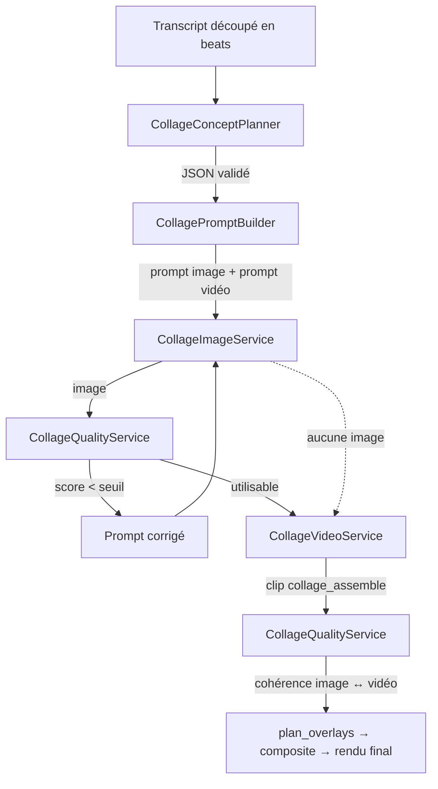

# CutForge — Moteur **Collage Premium B-roll** (`collage_assemble`)

> Comprendre le SENS d'une phrase, en tirer une métaphore visuelle, générer les
> pièces d'un collage papier éditorial, puis les assembler à l'écran.
> **Zéro intervention humaine** : l'utilisateur importe sa vidéo, c'est tout.

---

## 1. Ce que le moteur ajoute au produit

Avant, CutForge savait : couper les silences, supprimer les mots inutiles,
sous-titrer, générer des images B-roll, animer en Ken Burns, poser des overlays,
rendre. Toutes les illustrations étaient **littérales** : on montrait ce qui
était nommé.

Le moteur Collage Premium ajoute la couche manquante : **la représentation
symbolique**. Quand quelqu'un dit « la confiance se perd en une seconde », il n'y
a rien à photographier — il faut une image qui *raconte l'idée*. C'est
exactement ce que produit `collage_assemble` : un mur de briques qui s'écroule,
posé pièce par pièce sur un aplat de couleur.

| | Avant | Avec Collage Premium |
|---|---|---|
| Sujet de l'image | ce qui est **nommé** | ce que la phrase **veut dire** |
| Mouvement | Ken Burns (zoom/pan) | assemblage stop-motion depuis un fond vide |
| Identité visuelle | dépend du modèle image | **verrou de style** versionné |
| Validation | aucune | score qualité automatique + relance ciblée |
| Décision du type de visuel | fixe par mode | **routage automatique** par beat |

---

## 2. Analyse du dépôt de référence `MegaTroll222/VOX-COLLAGE-BROLL`

Le dépôt est une **skill Claude Code** : un `SKILL.md` qui pilote un opérateur
humain à travers un workflow interactif, plus des exemples. Ce n'est pas une
bibliothèque : il n'y avait donc rien à importer, seulement des **idées à
reprendre**.

### 2.1 Ce qui a été repris (et où)

| Concept du dépôt de référence | Reprise dans CutForge | Fichier |
|---|---|---|
| **Métaphore avant image** : décrire sens, émotion, 3–6 objets, palette, ordre d'assemblage AVANT de générer | Étape formalisée en contrat JSON validé (`CollageConcept`) | `collage_concept_planner.py` |
| **Verrou de prompt** (« premium editorial stop-motion paper collage; black-and-white halftone photographic cut-outs mixed with selective coloured cardstock ») | Repris comme constante `STYLE_LOCK`, étendu (contours crème, grain papier, ombres) et **versionné** | `collage_prompt_builder.py` |
| **Signature visuelle** : aplat de couleur, bords de découpe nets, contours crème, ombres papier, grain non couché, zéro typographie | Reprise intégralement, en positif **et** en négatif dans les prompts | `collage_prompt_builder.py` |
| **Assemble-from-empty** : le clip démarre sur un fond vide, les pièces sont posées une par une, pas de morphing, pas de mouvement de caméra | Devient un vrai moteur de rendu déterministe | `collage_video_service.py` |
| **Timing stop-motion** : les pièces claquent en place, elles n'apparaissent pas en fondu | Quantification en paliers (`STOP_MOTION_STEPS`) | `collage_video_service.py` |
| **QA de la vidéo** : première frame quasi vide, assemblage visible, dernière frame = still confirmé | Trois vérifications automatisées (fond vide au départ, progression, corrélation dernière frame ↔ image) | `collage_quality_service.py`, tests |
| **Anti-lettering** : détecter les artefacts de lettrage et **relancer sur le même modèle** plutôt que changer de modèle | Détecteur de glyphes + relance avec consignes correctives ciblées | `collage_quality_service.py`, `collage_pipeline.py` |
| **Traçabilité des générations** (job ids, ré-exécution) | `CollageAsset` (provider, modèle, essais, cache) + `CollageRunResult` sérialisé dans le rapport de job | `collage_types.py` |

### 2.2 Ce qui a été **volontairement écarté**

| Élément du dépôt | Raison |
|---|---|
| **Les trois portes d'approbation** (métaphore → still → vidéo) | Le produit est automatique. Chaque porte a été remplacée par un contrat vérifiable par la machine : schéma JSON validé, score qualité, corrélation image/vidéo. |
| **Modèle vidéo verrouillé** (`gemini-omni-flash`) | Verrouiller un fournisseur est l'inverse de l'architecture CutForge. Le style est verrouillé, **le fournisseur ne l'est pas**. |
| **MaxFusion MCP obligatoire** | Devient *un* provider parmi d'autres, choisi par configuration. |
| **Une ligne de script = un projet sur disque** (`~/collage-broll-projects/…`) | Les artefacts vivent dans le `workdir` du job, purgés par la rétention existante. |
| **Voix off générée + trim de silence** | CutForge part d'une vidéo réelle avec sa voix : la scène doit s'insérer dans un montage existant, pas produire un clip autonome. |
| **Durée fixe 5 s** | La scène dure le temps du propos qu'elle illustre (bornée 3–6 s), comme les scènes motion design du moteur. |
| **Contact sheets à inspecter** | Utile pour un humain, inutile ici : le score qualité décide. |

### 2.3 Améliorations apportées

1. **Analyse sémantique groupée.** Le dépôt interroge le modèle ligne par ligne.
   Ici, **une vidéo = un seul appel** : coût divisé par N, latence divisée par N.
2. **Layout partagé prompt ↔ animation.** Le prompt impose la zone de chaque
   objet ; l'animation réutilise ces mêmes zones pour découper l'image. C'est ce
   qui rend l'assemblage possible **localement**, sans modèle vidéo ni
   segmentation sémantique.
3. **Rendu déterministe.** Un modèle vidéo ne garantit jamais l'ordre
   d'apparition. Le compositeur local, si — à la frame près, et reproductible.
4. **Repli procédural.** Sans clé API, sans crédits, ou si la génération échoue,
   la scène existe quand même (collage d'aplats + trame). Le montage n'a jamais
   de trou.
5. **Cache content-addressed.** Concepts et images sont indexés par empreinte du
   contenu + version du style : deux vidéos qui disent la même chose ne paient
   qu'une fois, et changer le style invalide le cache tout seul.
6. **Relance corrective, pas relance à l'identique.** Les défauts détectés
   repartent dans le prompt en consignes explicites.
7. **Routage automatique.** Le collage n'est pas appliqué partout : un routeur
   décide, beat par beat, quelle famille de B-roll raconte le mieux l'idée.

---

## 3. Architecture

### 3.1 Place dans le produit

```
                    ┌──────────────────────────┐
   Upload ─────────►│  FastAPI  /videos /jobs  │
                    └────────────┬─────────────┘
                                 ▼
                    ┌──────────────────────────┐
                    │ Celery  process_video_v2 │
                    └────────────┬─────────────┘
                                 ▼
                    ┌──────────────────────────┐
                    │   pipeline_v2.run(...)   │  ← exporte la conf collage
                    └────────────┬─────────────┘
                                 ▼
        ┌────────────────────────────────────────────────┐
        │        autoedit_engine.pipeline.run(...)       │
        │                                                │
        │  0 subtitle_cleanup   7  plan_overlays         │
        │  1 transcribe         8  keyword_popup         │
        │  2 build_edl          9  video_dynamics        │
        │  3 overlays          10  composite             │
        │  4 motion_design     11  mix_sfx               │
        │ ►5bis COLLAGE◄       12  subs_ass              │
        │  5 genimg            13  finalize              │
        │  6 broll_anim                                  │
        └───────────────────────┬────────────────────────┘
                                ▼
                    app/processing/collage/   (le moteur)
```

Le moteur est branché **en amont** du B-roll photo : il prend les beats
« idée abstraite », le B-roll photo garde les scènes concrètes. Les deux ne se
disputent jamais le même instant (`plan_overlays` traite le collage comme un
occupant de la timeline au même titre que les scènes motion design).

### 3.2 Chaîne interne



Le trait pointillé est la garantie produit : **sans image, la scène est quand
même rendue** (collage procédural).

### 3.3 Fichiers

| Fichier | Rôle | Lignes clés |
|---|---|---|
| `collage_config.py` | toute la configuration (env), version du verrou de style, `refresh()` | `ENABLED`, `MAX_SCENES`, `STYLE_LOCK_VERSION` |
| `collage_types.py` | contrats de données + gabarits de layout | `CollageConcept`, `LAYOUT_TEMPLATES`, `BrollType` |
| `collage_cache.py` | cache disque content-addressed, écritures atomiques | `JsonCache`, `BinaryCache` |
| `collage_concept_planner.py` | analyse sémantique (LLM groupé + repli heuristique) | `CollageConceptPlanner.plan` |
| `collage_lexicon.py` | **ancrage**: mot prononcé → découpe, extraction des choses nommées | `LEXICON`, `ground`, `resolve` |
| `collage_prompt_builder.py` | **verrou de style**, prompts image et vidéo | `STYLE_LOCK`, `NEGATIVE_PROMPT` |
| `collage_image_service.py` | registre de fournisseurs + génération parallèle + cache | `register_provider`, `CollageImageService` |
| `collage_video_service.py` | mouvement `collage_assemble` (rendu local + API) | `LocalAssembleRenderer` |
| `collage_quality_service.py` | détecteurs qualité + consignes de relance | `review_image`, `retry_hints` |
| `collage_pipeline.py` | orchestration bout en bout | `CollagePipeline.run` |

Fichiers existants touchés (tous rétro-compatibles) :

| Fichier | Modification |
|---|---|
| `processing/types.py` | `BrollCue.broll_type` + `BrollCue.excerpt` (valeurs par défaut = comportement historique) |
| `processing/broll_planner.py` | **`BrollTypeRouter`** + `BrollPlanner` qui l'utilise (désactivable) |
| `autoedit_engine/content.py` | les « ideas » portent désormais `excerpt` et `concepts` |
| `autoedit_engine/pipeline.py` | étape `5bis collage`, `_split_collage_ideas`, `_run_collage`, rapport enrichi |
| `autoedit_engine/plan_overlays.py` | paramètre `collage_json`, placement + SFX papier |
| `processing/pipeline_v2.py` | `_export_collage_env`, preset de mode `collage_premium` |
| `api/v1/modes.py`, `config.py`, `.env.example` | mode sélectionnable + réglages produit |

---

## 4. Les sept étapes en détail

### 4.1 `CollageConceptPlanner` — comprendre avant de dessiner

Entrée : `[{id, source_start, source_end, text}]`.
Sortie : `CollageConcept` sérialisable.

```json
{
  "id": "br_002",
  "excerpt": "la confiance se construit lentement mais se perd en une seconde",
  "meaning": "la confiance demande du temps et disparaît instantanément",
  "emotion": "trust",
  "metaphor": "a wall built one brick at a time, collapsing at once",
  "objects": [
    {"name": "brick", "order": 1, "anchor": "center", "entrance": "drop",
     "paper_color": "#F7F1E3"},
    {"name": "hand", "order": 2, "anchor": "top_left", "entrance": "slide_left",
     "paper_color": "#1D1D1B"},
    {"name": "crack", "order": 3, "anchor": "top_right", "entrance": "scale_pop",
     "paper_color": "#F2B705"},
    {"name": "falling wall", "order": 4, "anchor": "bottom_center",
     "entrance": "slide_right", "paper_color": "#2E5EAA"}
  ],
  "sequence": ["brick", "hand", "crack", "falling wall"],
  "background_color": "#E8452C",
  "palette": ["#F7F1E3", "#1D1D1B", "#F2B705"],
  "label": "CONFIANCE",
  "planner": "llm",
  "confidence": 0.9
}
```

Trois chemins, dans cet ordre :

1. **Cache** — empreinte `sha256(texte + version du style)`.
2. **LLM groupé** — un seul appel pour toute la vidéo, réponse validée :
   3–6 objets, aucun nom contenant chiffre ou guillemet (du texte déguisé),
   métaphore d'au moins 8 caractères, couleurs normalisées. Une réponse
   non conforme est **rejetée**, pas rafistolée.
3. **Heuristique** — bibliothèque de 28 métaphores indexée sur les concepts déjà
   détectés par `autoedit_engine.content.icon_for_text` (**aucune règle
   dupliquée**), émotion déduite par expressions régulières, palette seedée.

### 4.1bis `collage_lexicon` — l'ancrage: ce qui est DIT décide de ce qui est DESSINÉ

Le défaut le plus visible du moteur n'était pas la qualité des découpes, c'était
leur **pertinence**: quelqu'un parle de sa voiture, la scène montre un flacon.
Trois causes, toutes fermées.

| Cause | Ce qui se passait | Correction |
|---|---|---|
| **Vocabulaire trop étroit** | 34 découpes, toutes issues du discours e-commerce. Ni voiture, ni maison, ni ordinateur, ni rendez-vous. | **92 découpes** (`collage_shapes`), couvrant les objets du quotidien les plus prononcés en français parlé **et** tous les objets nommés par les bibliothèques de métaphores. |
| **Repli arbitraire** | Un mot inconnu retombait sur `sha1(mot) % N`: une forme *stable*, donc **fausse à chaque rendu**, donc visible. | `resolve_strict()` renvoie **None**. Un None est exploitable (« je ne sais pas dessiner ça »), une forme au hasard est un mensonge visuel. |
| **Aucune remontée du texte** | Les objets venaient d'une **catégorie** devinée (prix → étiquette + pièces). Le collage illustrait le *type* de propos, jamais son *sujet*. | `ground(texte)` extrait les choses concrètes réellement nommées, dans l'ordre où elles sont dites, et le planner les **pousse en tête** du concept. |

```python
ground("j'ai vendu ma voiture pour acheter une maison")
# [Entity(voiture → car), Entity(acheter → cart), Entity(maison → house)]
```

L'ancrage s'applique aux **trois chemins** du planner (cache, LLM, heuristique):
la précision ne doit pas dépendre de la présence d'une clé API. Deux règles
seulement:

* **le sujet ouvre la scène** — au plus `COLLAGE_GROUNDED_OBJECTS` objets sont
  imposés par le texte, le reste vient du concept (tout ancrer transformerait
  la scène en inventaire de mots);
* **aucun objet indessinable ne survit** quand le profil illustre par découpes
  (moteurs UGC). Il est remplacé par une chose réellement dite, ou retiré. Le
  profil éditorial garde ses objets abstraits: c'est un modèle d'image qui les
  dessine, il n'est pas limité au vocabulaire des découpes — mais son prompt
  reçoit quand même le **sujet littéral** (§ 4.2).

Le lexique est **une seule table** pour deux usages: résoudre un nom d'objet et
reconnaître une chose dans le transcript. Impossible, donc, que « ce que le
moteur sait dessiner » diverge de « ce qu'il sait reconnaître ».

Les pièges du français parlé sont traités explicitement et testés un par un:
« je te **livre** le colis » n'est pas un bouquin, « je vais te **montrer** »
n'est pas une montre, « c'est cher **car** je l'ai importé » n'est pas une
voiture, « **son** produit » n'est pas du son, « **au cours de** » n'est pas un
cours, « le **lien** en bio » n'est pas une chaîne.

### 4.1ter La composition — une scène qui se LIT en deux secondes

L'ancrage règle *ce qu'on montre*; ces règles règlent *comment on le montre*.
Toutes ont été décidées en regardant des rendus, pas du code.

| Règle | Le défaut qu'elle corrige |
|---|---|
| **Quatre pièces au plus** (`COLLAGE_SCENE_OBJECTS`) | À six éléments de taille voisine, la scène devenait une planche de timbres: l'œil n'avait aucun point d'entrée. Le contrat de données accepte toujours six objets (`MAX_OBJECTS`), mais le rendu n'en pose que quatre. |
| **Le sujet reçoit la plus grande cellule**, puis un facteur `COLLAGE_HERO_SCALE` | La cellule héros existait déjà, mais l'écart de rayon entre cellules était trop faible pour se voir. La voiture dont on parlait faisait la taille de la coche décorative à côté. |
| **La profondeur suit la taille** | Ombre et contour à taille fixe: toutes les pièces semblaient posées à la même altitude, ce qui annulait la hiérarchie que le layout venait d'établir. |
| **Papiers harmonisés** | Le tour de rôle `papers[i % n]` collait deux feuilles identiques côte à côte et laissait passer un papier de la même valeur que le fond — la pièce disparaissait, il ne restait que son contour crème. Désormais: aucun papier fondu dans le fond, le sujet prend le plus contrasté, et deux voisines ne partagent jamais leur couleur. |
| **Fonds alternés entre scènes voisines** | Deux plans jaunes qui s'enchaînent se lisent comme un seul long plan: la coupe disparaît. |
| **Découpes non répétées d'une scène à l'autre** | Sur une vidéo d'une minute, revoir la même coche et la même étincelle à chaque plan se remarque immédiatement. Seul le SUJET a le droit de revenir — s'il reparle de sa voiture, la voiture revient. |
| **Feuilles d'aspects variés, inclinaison seedée** | Quatre carrés identiques inclinés en alternance stricte font un gabarit, pas une main qui pose du papier. |
| **Trame proportionnelle à la pièce** | À période fixe en pixels, une grande pièce recevait de gros pois au lieu d'une trame d'impression. |

Deux découpes ne doivent jamais se ressembler: `flame` et `drop` dérivaient du
même contour, si bien que « ça cartonne » et « hydratation » produisaient
exactement la même image. Un test compare désormais le rendu réel des 92
découpes deux à deux et refuse toute nouvelle paire indistinguable — à
l'exception de `check`/`cross`, jumelles **volontaires** (mêmes disques,
marques opposées).

### 4.2 `CollagePromptBuilder` — le verrou de style

Une constante, une version. Tout changement de `STYLE_LOCK` impose
d'incrémenter `STYLE_LOCK_VERSION`, ce qui invalide le cache automatiquement.

Le prompt image porte aussi l'**ancrage littéral**: quand la phrase nomme une
chose matérielle, le prompt exige qu'elle soit reconnaissable. Sans cette ligne,
le style pousse le modèle vers l'abstraction — il illustre volontiers « la
liberté » quand la personne parle de sa voiture.

Les interdits (`NO text, NO logo, NO watermark`, …) sont écrits **deux fois** :
dans le prompt positif et dans le `negative_prompt` — beaucoup de modèles
ignorent le second.

Le prompt image porte le **layout** : chaque objet reçoit une zone du cadre
(`LAYOUT_TEMPLATES[3..6]`) et sa couleur de papier. Le prompt vidéo décrit
l'assemblage depuis le fond vide, l'ordre exact, et interdit tout mouvement de
caméra ou fondu.

### 4.3 `CollageImageService` — aucun fournisseur codé en dur

```python
class CollageImageProvider(Protocol):
    name: str
    def generate(self, prompt: str, *, aspect_ratio: str = "9:16",
                 negative_prompt: str = "", timeout_s: int = 180) -> GeneratedImage: ...

register_provider("mon_vendor", MonVendorProvider)   # c'est tout
```

Livrés : `openrouter` (adaptateur sur le provider **existant** du pipeline V2 —
non réécrit), `google_ai_studio`, `maxfusion`, `noop`.
Résolution : `COLLAGE_IMAGE_PROVIDER` → `IMAGE_GENERATION_PROVIDER` → `noop`.
Un provider inconnu, cassé ou sans clé retombe sur `noop` : **jamais d'exception
qui remonte au rendu**.

### 4.4 `CollageVideoService` — le mouvement `collage_assemble`

```
t=0          fond vide (aplat + grain papier)
t=0.10·D     pièce 1 posée   (drop)
t=0.26·D     pièce 2 posée   (slide_left)
t=0.42·D     pièce 3 posée   (scale_pop, léger dépassement)
t=0.58·D     pièce 4 posée   (rotate_in)
t→D          scène tenue, respiration 3 % (pas un zoom)
```

Le rendu local découpe l'image finale en pièces par **partition au plus proche
centre de cellule** (pondérée par le rayon). Chaque pièce reçoit son contour
crème et son ombre courte, puis est composée avec sa transformation d'entrée,
quantifiée en paliers stop-motion. L'union des pièces reconstitue l'image finale
au pixel près : la dernière frame **est** l'image générée.

Sortie : ProRes 4444 RGBA `.mov`, exactement le format des overlays du moteur —
`composite.py` n'a pas été modifié.

### 4.5 `CollageQualityService` — le remplaçant des portes d'approbation

| Vérification | Méthode | Éliminatoire |
|---|---|---|
| Absence de texte / faux caractères | bandes de « glyphes » : lignes à marques nombreuses **et fines**, groupées en bandes courtes **isolées** sur du calme | oui |
| Absence de watermark | anomalie de densité de contours dans les coins + glyphes en marge | oui |
| Séparation des éléments | nombre de régions de couleur dominantes vs nombre d'objets attendus | non |
| Lisibilité de la métaphore | combinaison séparation + clarté + cohérence | non |
| Cohérence graphique | distance à la palette verrouillée + « aplatitude » | non |
| Clarté visuelle | densité de contours dans une plage saine + contraste | non |
| Cohérence image ↔ vidéo | corrélation dernière frame du clip / image de référence | oui |

```json
{"visual_clarity": 92, "style_consistency": 95, "usable": true}
```

Un piège a été traité explicitement : **la trame N&B fait partie du style**. Un
détecteur naïf la prend pour du lettrage et relance chaque scène deux fois pour
rien. Le détecteur écarte les textures régulières (bandes non isolées, trame
occupant plus de la moitié du cadre) — c'est couvert par un test dédié.

Ces détecteurs sont heuristiques et locaux : quelques millisecondes, aucune API.
Ils attrapent les défauts grossiers, pas les fautes de goût. C'est assumé : leur
rôle est de décider s'il faut **relancer**, pas de noter une œuvre.

### 4.6 `CollagePipeline` — l'orchestrateur

Boucle de relance : au plus `COLLAGE_QUALITY_MAX_ATTEMPTS` essais par scène, et
on garde toujours le **meilleur** essai même si aucun n'est parfait — un visuel
imparfait vaut mieux qu'un trou dans le montage. Le nombre total d'essais est
remonté dans le rapport (`images_retried`) pour suivre le coût réel.

### 4.7 `BrollTypeRouter` — le choix automatique du type

```python
BrollType.STATIC_IMAGE | STOCK_VIDEO | AI_VIDEO | MOTION_DESIGN | COLLAGE_PREMIUM
```

| Signal dans le transcript | Famille choisie |
|---|---|
| énumération, pourcentage, chiffre | `motion_design` |
| scène physique nommée (règles `TOPIC_RULES` existantes) | `static_image` |
| ambiance filmable sans idée abstraite | `stock_video` * |
| mouvement décrit (« il court », « ça roule ») | `ai_video` * |
| idée abstraite, comparaison (« c'est comme »), causalité | **`collage_premium`** |

\* points d'extension : désactivés par défaut, car les activer sans moteur
derrière ne créerait aucun visuel.

Le routeur est **pur** (mêmes entrées → même sortie) et **partagé** par le
pipeline V2 modulaire et par le moteur Auto Edit : une seule règle de décision
dans tout le produit. Un quota (`COLLAGE_MAX_SHARE`) garde les métaphores les
mieux notées et renvoie le reste vers l'image — budget **et** variété visuelle.

---

## 5. Interfaces publiques

```python
# Orchestration
CollagePipeline(planner=, prompt_builder=, image_service=, video_service=,
                quality_service=, max_scenes=)
    .run(beats: Sequence[dict], workdir: str, render: bool = True) -> CollageRunResult

run_collage_for_ideas(ideas, workdir, *, max_scenes=None,
                      allow_paid_images=True) -> CollageRunResult

# Étapes
CollageConceptPlanner(api_key=, model=, use_llm=, cache=).plan(beats) -> [CollageConcept]
CollagePromptBuilder(aspect_ratio=).build(concept, quality_hints=None) -> CollagePrompts
CollageImageService(provider=, timeout_s=, cache=, max_workers=)
    .generate(concept, prompts, out_dir, attempt=1) -> CollageAsset
    .generate_many(items, out_dir, attempt=1)       -> [CollageAsset]
CollageVideoService(renderer=, max_workers=)
    .animate(concept, image_path, out_dir, prompts=, duration=) -> CollageClip | None
CollageQualityService(min_score=, enabled=)
    .review_image(image_path, concept) -> QualityReport
    .review_clip(clip_path, image_path, report=) -> QualityReport
    .retry_hints(report) -> [str]

# Routage
BrollTypeRouter(enabled=, collage_share=)
    .choose(text) -> BrollRoutingDecision
    .route_many(texts) -> [BrollRoutingDecision]
```

Contrat de sortie vers la timeline — volontairement **identique** à celui de
`broll_anim.render_all`, ce qui évite toute modification du placement :

```python
CollageClip.to_engine_overlay()
# {"id", "mov", "duration", "source_start", "source_end", "label",
#  "kind": "collage_assemble"}
```

---

## 5bis. Les trois moteurs de collage (profils)

La mécanique décrite ci-dessus est **la même pour les trois moteurs produit**.
Ce qui les distingue tient dans un *profil* (`collage_profiles.py`) : direction
artistique, politique de coût, part des beats, plafond de scènes. Ajouter une
quatrième direction ne demande aucune modification du pipeline.

| Mode de montage | Profil | Images IA | Motion design | Ce qui illustre |
|---|---|---|---|---|
| `collage_premium` | `editorial` | oui, si crédits | oui | image générée découpée, ou pièces dessinées en repli |
| `collage_ugc_product` | `ugc_product` | **jamais** | non | pièces dessinées uniquement |
| `collage_ugc_motion` | `ugc_motion` | **jamais** | oui | pièces dessinées + scènes motion design |

### Illustrer sans image générée

Les moteurs UGC n'appellent aucune API d'image. Chaque objet du concept est
traduit en **pictogramme vectoriel découpé dans du papier**
(`collage_shapes.py` : ~34 formes, bord déchiré, trame, contour crème, ombre
courte). Le vocabulaire visuel est identique à celui des pièces issues d'une
image générée, donc les trois moteurs restent cohérents entre eux dans une même
bibliothèque de contenus.

Le rendu construit alors **une pièce par objet** au lieu de partitionner une
image : chaque élément a sa forme propre et sa propre entrée d'animation.

### Direction produit

Le profil UGC remplace la bibliothèque de métaphores abstraites par une
détection d'**intention produit** sur le discours (prix, livraison, avis,
garantie, résultat, ingrédients, utilisation, commande, problème, urgence,
déballage, comparaison). La consigne envoyée au planner texte change aussi :
elle demande une illustration **littérale et reconnaissable**, pas une
métaphore poétique.

### Les deux leviers de coût, séparés

* `allow_ai_images` — génération d'**image** (le poste de coût dominant).
  À `False` sur les deux profils UGC, **définitivement** : même une clé API
  présente ne déclenche aucun appel.
* `allow_planner_llm` — analyse **texte** (un seul appel par vidéo, sur un
  modèle bon marché). Conservée par défaut : c'est elle qui fait que le collage
  parle du produit dont la personne parle. La désactiver rend le moteur
  strictement hors-ligne (repli sur la bibliothèque du profil).

Côté montage, `visual_mode: credit_saver` verrouille en plus tous les appels
d'image du moteur Auto Edit (B-roll photo **et** illustrations de motion
design). Les deux verrous sont volontairement redondants.

---

## 6. Configuration

| Variable | Défaut | Effet |
|---|---|---|
| `ENABLE_COLLAGE_BROLL` / `COLLAGE_BROLL_ENABLED` | `false` | **opt-in global** |
| `COLLAGE_PROFILE` | `editorial` | `editorial` \| `ugc_product` \| `ugc_motion` |
| `COLLAGE_IMAGE_PROVIDER` | *(vide → `IMAGE_GENERATION_PROVIDER`)* | fournisseur d'images |
| `COLLAGE_IMAGE_MODEL` | *(vide)* | modèle image |
| `GOOGLE_AI_STUDIO_API_KEY`, `MAXFUSION_API_KEY` | — | clés des fournisseurs additionnels |
| `COLLAGE_VIDEO_PROVIDER` | `local` | `local` (déterministe) ou `http` (API image→vidéo) |
| `COLLAGE_MAX_SCENES` | *(profil : 4 / 8 / 6)* | plafond de scènes par vidéo |
| `COLLAGE_MAX_SHARE` | *(profil : 0.5 / 1.0 / 0.7)* | part des beats routés en collage |
| `COLLAGE_GROUNDING` | `1` | ancrage lexical (§ 4.1bis). `0` = comportement historique |
| `COLLAGE_GROUNDED_OBJECTS` | `2` | objets imposés par le texte prononcé |
| `COLLAGE_SCENE_OBJECTS` | `4` | pièces réellement posées par scène (§ 4.1ter) |
| `COLLAGE_HERO_SCALE` | `1.28` | taille du sujet par rapport aux appuis |
| `COLLAGE_QUALITY_MIN_SCORE` | `62` | seuil d'acceptation |
| `COLLAGE_QUALITY_MAX_ATTEMPTS` | `2` | `1` désactive la relance |
| `COLLAGE_CACHE_ENABLED` / `_TTL_DAYS` | `1` / `30` | cache concepts + images |
| `COLLAGE_IO_WORKERS` / `_RENDER_WORKERS` | `4` / `2` | parallélisme réseau / rendu |

Deux façons de l'activer :

* **par job** — un des trois modes de montage `collage_premium`,
  `collage_ugc_product`, `collage_ugc_motion` (visibles dans `GET /jobs/modes`),
  ou les options `{"collage_broll": true, "collage_profile": "ugc_product"}` ;
* **globalement** — `ENABLE_COLLAGE_BROLL=true`.

`pipeline_v2._export_collage_env()` traduit les réglages produit en variables
d'environnement avant le rendu (même mécanique que `OPENROUTER_API_KEY`), et
`collage_config.refresh()` les relit côté moteur.

---

## 7. Performance et coût

| Levier | Détail | Gain |
|---|---|---|
| **Analyse groupée** | 1 appel LLM par vidéo au lieu de 1 par beat | ÷ N sur le coût et la latence de l'étape 2 |
| **Cache content-addressed** | concepts (JSON) et images (PNG) indexés par empreinte contenu + version du style | 100 % d'économie sur un contenu déjà vu ; écritures atomiques, sûr en multi-worker |
| **Parallélisme différencié** | génération d'images = I/O → 4 workers ; rendu = CPU → 2 workers | ~4× sur les appels réseau sans saturer le VPS |
| **Quota de scènes** | `MAX_SCENES` + `MAX_SHARE` | plafonne le coût par vidéo, quelle que soit sa durée |
| **Relance corrective bornée** | 2 essais max, consignes ciblées | évite la boucle de relances identiques |
| **Rendu local par défaut** | pas d'API vidéo | coût vidéo nul, latence prévisible |
| **Layers pré-calculés** | pièces découpées une fois, seulement transformées par frame | évite N découpes par clip |
| **Respiration en bilinéaire** | un agrandissement de 3 % ne mérite pas du LANCZOS sur du 1080×1920 | **−33 %** sur le temps de rendu d'un clip (mesuré : 11,8 s → 8,0 s) |

**Mesure de référence** (1080×1920, 30 fps, clip de 4,2 s, 5 objets, un cœur) :
126 frames en **8,0 s**. Avec 4 scènes et 2 workers : **~16 s** ajoutés à un
rendu, à comparer aux minutes que prend déjà un montage complet.

**Passage à l'échelle (milliers de vidéos/jour).** Le moteur est *stateless* :
tout l'état vit dans le `workdir` du job et dans un cache partagé sur disque.
Il suit donc l'élasticité Celery existante. Les trois points à surveiller sont
identifiés : le cache doit être un volume partagé entre workers, le
parallélisme CPU doit rester sous le nombre de cœurs par worker, et les quotas
par vidéo sont le seul garde-fou de coût API.

---

## 8. Risques identifiés

| Risque | Gravité | Traitement en place | Reste à faire |
|---|---|---|---|
| Le contrôle qualité est **heuristique** : il peut laisser passer un défaut subtil ou relancer à tort | moyenne | seuils configurables ; on garde toujours le meilleur essai ; faux positif de la trame traité et testé | passe de relecture par un modèle vision, en option payante |
| **Découpe par layout, pas sémantique** : si le modèle image ignore les zones demandées, une « pièce » peut couper un objet en deux | moyenne | layout imposé dans le prompt, bords adoucis, contour crème qui masque la jointure | segmentation (SAM ou équivalent) derrière un flag |
| **Coût API** si les quotas sont mal réglés | moyenne | `MAX_SCENES`, `MAX_SHARE`, cache, `noop` par défaut | budget par utilisateur/plan |
| **Dérive de style** entre fournisseurs | moyenne | verrou de style versionné + score de cohérence | jeu d'images de référence par fournisseur |
| **Charge CPU** du rendu local sur petit VPS | faible | `RENDER_WORKERS`, nettoyage des intermédiaires | file dédiée pour les rendus lourds |
| **Qualité du planner sans LLM** : les métaphores de repli tournent sur 28 familles | faible | bibliothèque variée + palette seedée | enrichir la bibliothèque |
| **Cache partagé** : sans volume commun, chaque worker paie son propre cache | faible | `COLLAGE_CACHE_DIR` configurable | Redis/S3 pour le cache d'images |
| Un provider lent bloque un rendu | faible | timeouts explicites, échec non bloquant | budget de temps global par job |

---

## 9. Prochaines évolutions

1. **Mode Studio** (déjà prévu au produit) : exposer concepts et images générés,
   permettre de rejouer une scène avec une métaphore choisie. Toute la donnée
   est déjà là — `CollageRunResult` est sérialisé dans le rapport de job.
2. **Relecture vision** : brancher un modèle multimodal sur
   `CollageQualityService` en second avis quand le score heuristique est dans la
   zone grise (55–70).
3. **Vidéo générative** : `COLLAGE_VIDEO_PROVIDER=http` est déjà là ; reste à
   comparer, sur un corpus, l'assemblage IA au rendu local.
4. **Stock vidéo et vidéo IA** : les deux familles sont dans `BrollType` et
   scorées par le routeur, mais désactivées faute de moteur. Les brancher ne
   demande aucun changement de routage.
5. **Apprentissage des métaphores** : mémoriser les concepts dont les vidéos
   performent le mieux et les privilégier.
6. **Déclinaisons de style** : le verrou est une constante versionnée — ajouter
   une « famille » (collage néon, collage kraft…) sélectionnable par mode est un
   ajout de constante, pas une refonte.
7. **Segmentation réelle** des pièces pour affranchir l'animation du layout.

---

## 10. Tests

`backend/tests/test_collage_engine.py` — 45 tests, sans réseau ni ffmpeg :

* routage (abstrait / énumération / concret, quota, familles désactivées) ;
* planner : concept valide, appel groupé, rejet du texte déguisé, repli,
  cache ;
* verrou de style, layout dans le prompt, prompt vidéo, consignes de relance ;
* registre de fournisseurs (extension, inconnu, cassé), cache indexé par prompt ;
* animation : partition en pièces, **fond vide au départ**, progression, ordre,
  repli procédural, contrat de sortie ;
* qualité : collage propre accepté, lettrage rejeté, **trame non confondue avec
  du texte**, contrat public du rapport ;
* orchestration : bout en bout, relance ciblée, survie sans images, plafond ;
* non-régression : moteur éteint par défaut, `plan_overlays` inchangé sans
  collage, SFX pris dans le vocabulaire existant, mode sélectionnable.

`backend/tests/test_collage_grounding.py` — 42 tests sur la **précision
d'illustration** :

* couverture du vocabulaire (voiture, maison, ordinateur, avion, diplôme…) ;
* lexique et bibliothèque de découpes toujours alignés, aucun objet de
  bibliothèque indessinable ;
* mot inconnu → `None` (et non une forme au hasard), contrat historique du
  résolveur permissif conservé ;
* la chose nommée est dans la scène, elle l'ouvre, et aucune découpe n'est
  répétée ;
* les sept pièges du français parlé (livre/livrer, montre/montrer, car, son,
  cours, lien en bio, d'accord) ;
* le prompt image nomme le sujet littéral, et la métaphore reste seule quand la
  phrase n'a aucun objet matériel.

```bash
cd backend && python -m pytest tests/test_collage_engine.py \
                              tests/test_collage_engines_ugc.py \
                              tests/test_collage_grounding.py -q
```
