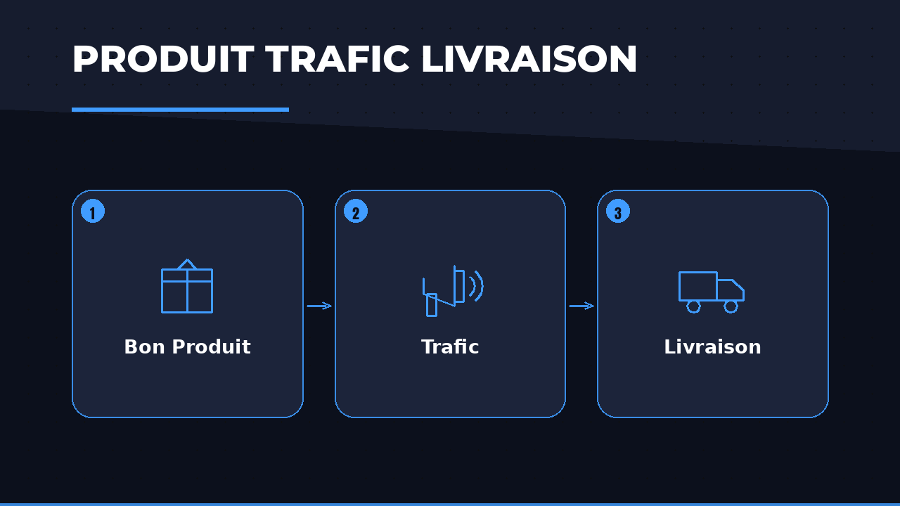
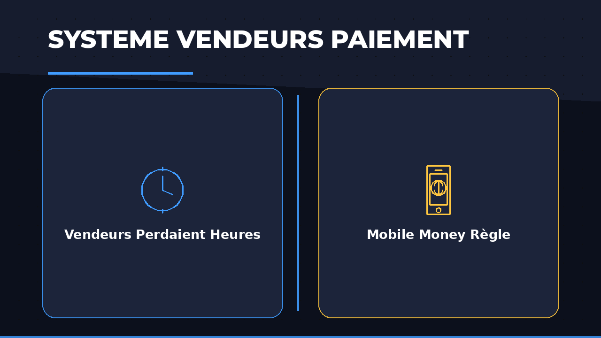
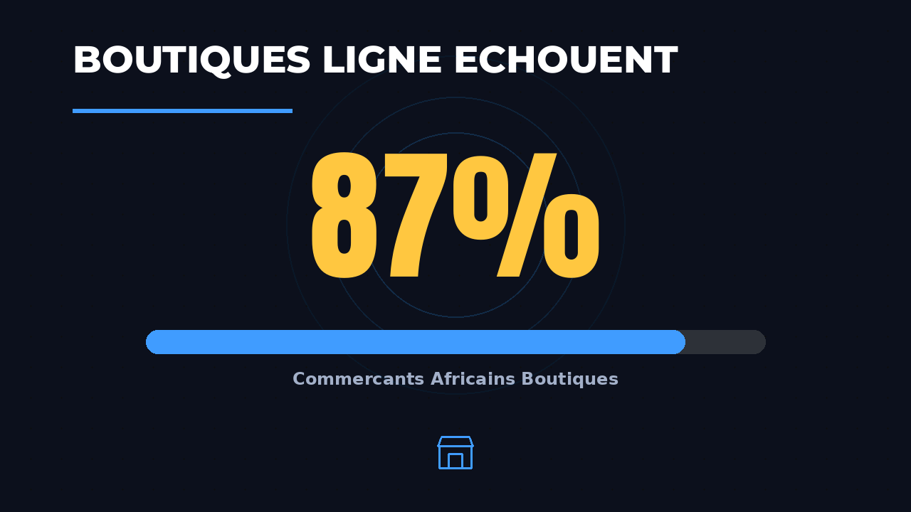
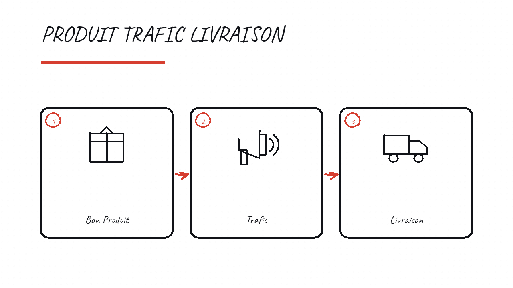
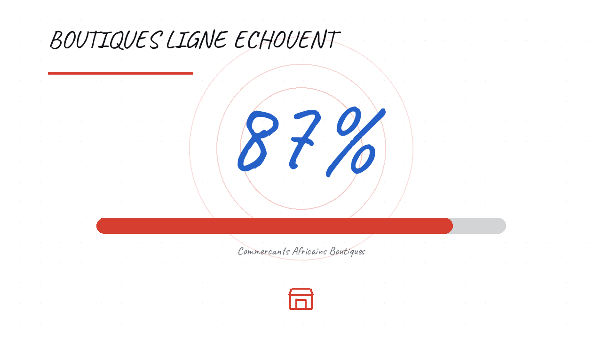

# Moteur d'illustration — exemples réels

> Toutes les sorties de ce document ont été **produites par le moteur**, pas
> écrites à la main. Reproduisez-les avec les commandes de la dernière section.

---

## 1. Ce que l'analyseur comprend

Une phrase entre, une figure de discours et sa matière en sortent. Aucun modèle,
aucun réseau : c'est le mode `offline`.

| Figure détectée | Matière extraite | Phrase |
|---|---|---|
| `list` | Produit, Trafic, Livraison | Pour réussir en e-commerce, vous devez maîtriser trois cho… |
| `steps` | Bon Produit, Trafic, Livraison | Premièrement vous trouvez un bon produit, ensuite vous att… |
| `comparison` | Vendeurs Perdaient Heures, Mobile Money Règle | Avant, les vendeurs perdaient des heures à encaisser ; mai… |
| `number` | 87% | 87% des boutiques en ligne échouent pendant la première an… |
| `problem_solution` | Personne Ne Suit, Tableau Bord Hebdomadaire | Le problème, c'est que personne ne suit ses marges. La sol… |
| `definition` | L'Intelligence Artificielle, système qui apprend à partir de données | L'intelligence artificielle est un système qui apprend à p… |
| `architecture` | Serveur, Client, Entrepot | Le client envoie sa commande, le serveur traite le paiemen… |
| `list` | Répétition, Pratique, Repos | Pour apprendre efficacement, il faut trois habitudes : la … |
| `keyword` | — | Salut à tous, bienvenue dans cette vidéo, abonnez-vous à l… |

Deux choses méritent l'attention :

* **« trois habitudes »** est reconnu comme une liste alors que « habitude »
  n'appartient à aucune liste de noms codée en dur : la détection est
  générique — une annonce de compte suivie d'une énumération.
* **La salutation ne produit rien.** Elle est classée `keyword`, sans matière,
  et son score visuel tombe sous le seuil. C'est le comportement voulu :
  l'animation doit expliquer, pas décorer.

---

## 2. Un storyboard complet

Transcript simulé de 62 secondes, treize phrases, mélangeant contenu réel et
remplissage. Le moteur tourne trois fois, en ne changeant que l'intensité.


**Intensité `low`** — 1 scènes, couverture 9.6%

| Moment | Type | Titre généré | Score |
|---|---|---|---|
| 00:15 | process | «PRODUIT TRAFIC LIVRAISON» | 0.87 |

**Intensité `medium`** — 2 scènes, couverture 15.9%

| Moment | Type | Titre généré | Score |
|---|---|---|---|
| 00:15 | process | «PRODUIT TRAFIC LIVRAISON» | 0.87 |
| 00:38 | statistics | «BOUTIQUES LIGNE ECHOUENT» | 0.79 |

**Intensité `high`** — 3 scènes, couverture 23.6%

| Moment | Type | Titre généré | Score |
|---|---|---|---|
| 00:15 | process | «PRODUIT TRAFIC LIVRAISON» | 0.87 |
| 00:26 | comparison | «SYSTEME VENDEURS PAIEMENT» | 0.81 |
| 00:38 | statistics | «BOUTIQUES LIGNE ECHOUENT» | 0.79 |

Ce qu'il faut lire dans ce tableau :

* **la salutation et le remerciement n'apparaissent jamais**, à aucune
  intensité ;
* **l'intensité ne change pas l'ordre de préférence** : la meilleure
  opportunité (score 0,87) est retenue en premier dans les trois cas, les
  suivantes s'ajoutent quand le budget le permet ;
* **la couverture reste faible** — 9,6 % à 23,6 % — donc le visage occupe
  toujours plus des trois quarts de la vidéo.

---

## 3. Une scène, en détail

La première scène du storyboard ci-dessus, telle que le moteur la décrit avant
de la rendre :

```json
{
  "scene_id": "ill_001",
  "start": 15.45,
  "end": 21.4,
  "duration": 5.95,
  "visual_type": "process",
  "pattern": "steps",
  "visual_score": 0.872,
  "importance": 0.543,
  "title": "PRODUIT TRAFIC LIVRAISON",
  "subtitle": "ÉTAPES",
  "style": "professional",
  "elements": [
    {
      "reveal_order": 1,
      "role": "title",
      "shape": "",
      "text": "PRODUIT TRAFIC LIVRAISON",
      "icon": ""
    },
    {
      "reveal_order": 2,
      "role": "underline",
      "shape": "underline",
      "text": "",
      "icon": ""
    },
    {
      "reveal_order": 3,
      "role": "item",
      "shape": "node",
      "text": "Bon Produit",
      "icon": "parcel"
    },
    {
      "reveal_order": 4,
      "role": "item",
      "shape": "node",
      "text": "Trafic",
      "icon": "megaphone"
    },
    {
      "reveal_order": 5,
      "role": "item",
      "shape": "node",
      "text": "Livraison",
      "icon": "truck"
    },
    {
      "reveal_order": 6,
      "role": "connector",
      "shape": "arrow_h",
      "text": "",
      "icon": ""
    },
    {
      "reveal_order": 7,
      "role": "connector",
      "shape": "arrow_h",
      "text": "",
      "icon": ""
    }
  ],
  "animation_sequence": [
    {
      "element_id": "ill_001_e01",
      "action": "draw",
      "start": 0.12,
      "duration": 1.4,
      "easing": "ease_out_cube"
    },
    {
      "element_id": "ill_001_e02",
      "action": "wipe",
      "start": 2.27,
      "duration": 0.22,
      "easing": "ease_out_cube"
    },
    {
      "element_id": "ill_001_e03",
      "action": "pop",
      "start": 2.494,
      "duration": 0.51,
      "easing": "ease_out_back"
    },
    {
      "element_id": "ill_001_e04",
      "action": "pop",
      "start": 3.061,
      "duration": 0.376,
      "easing": "ease_out_back"
    },
    {
      "element_id": "ill_001_e05",
      "action": "pop",
      "start": 3.478,
      "duration": 0.456,
      "easing": "ease_out_back"
    },
    {
      "element_id": "ill_001_e06",
      "action": "connect",
      "start": 3.985,
      "duration": 0.22,
      "easing": "ease_out_cube"
    },
    {
      "element_id": "ill_001_e07",
      "action": "connect",
      "start": 4.194,
      "duration": 0.22,
      "easing": "ease_out_cube"
    }
  ],
  "sfx": [
    {
      "sfx": "riser",
      "t": -0.45,
      "gain": 0.275
    },
    {
      "sfx": "transition",
      "t": 0.0,
      "gain": 0.319
    },
    {
      "sfx": "marker",
      "t": 2.27,
      "gain": 0.209
    },
    {
      "sfx": "pop",
      "t": 2.494,
      "gain": 0.33
    },
    {
      "sfx": "pop",
      "t": 3.061,
      "gain": 0.33
    },
    {
      "sfx": "pop",
      "t": 3.478,
      "gain": 0.33
    },
    {
      "sfx": "whoosh",
      "t": 3.985,
      "gain": 0.286
    },
    {
      "sfx": "whoosh",
      "t": 4.194,
      "gain": 0.286
    },
    {
      "sfx": "exit",
      "t": 5.55,
      "gain": 0.275
    }
  ]
}
```

À lire ainsi :

* `pattern: "steps"` — le discours énumère des étapes ;
* `visual_type: "process"` — donc des nœuds reliés par des flèches, pas une
  liste de puces ;
* les trois éléments portent **leurs propres icônes** (`parcel`, `megaphone`,
  `truck`), choisies sur le sens de leur libellé, sans répétition dans la
  scène ;
* les `connector` en `arrow_h` sont révélés **après** les nœuds qu'ils
  relient : la flèche apparaît une fois qu'il y a quelque chose à relier ;
* chaque son est attaché à un événement visuel — `riser` à −0,45 s (avant
  l'image), `pop` sur chaque nœud, `whoosh` sur chaque flèche, `exit` à la
  sortie.

---

## 4. Rendus

### Style `professional`

Processus — la scène JSON ci-dessus, rendue :



Comparaison — deux panneaux, deux accents, l'horloge contre le mobile money :



Statistique — le chiffre porte la scène, la jauge le situe :



### Style `whiteboard`

Le même contenu, dessiné à la main : encre noire, un seul marqueur de couleur,
cadres tracés, texte écrit caractère par caractère.



Le style et le type de scène sont **orthogonaux** : une statistique en style
whiteboard reste une statistique, écrite au feutre.



---

## 5. Le même plan en 9:16

Les compositions sont exprimées en coordonnées normalisées `0..1`, donc le
storyboard est identique et seul le placement change :

```python
from app.illustration_engine import IllustrationDirector

vertical = IllustrationDirector(style="professional", aspect="9:16")
board = vertical.storyboard(vu)      # mêmes scènes, colonnes -> lignes
```

En 16:9 les éléments d'un processus sont posés en **colonnes** reliées par des
flèches horizontales ; en 9:16 ils deviennent des **lignes** reliées par des
flèches verticales. Aucune seconde passe de layout.

---

## 6. Repli quand tout va mal

```python
from app.illustration_engine.renderers import RendererRouter

router = RendererRouter("whiteboard", 1920, 1080, 30)
[r.name for r in router.chain(scene)]
# ['whiteboard', 'motion_graphics', 'kinetic_typography']
```

Si `whiteboard-animator` n'est pas installé, `WhiteboardRenderer` dessine
lui-même. S'il échoue quand même, `MotionGraphicsRenderer` reprend la scène et
`rendered.fallback_from` porte `"whiteboard"`. Si toute la chaîne échoue, la
scène est abandonnée et **le montage continue**.

De même côté analyse :

```
CloudProvider indisponible → FreeLLMAPI indisponible → analyseur heuristique
```

---

## 7. Reproduire ces exemples

```bash
cd backend

# Ce que l'analyseur comprend d'une phrase
python -c "
from app.illustration_engine.analyzer import SemanticAnalyzer
u = SemanticAnalyzer().analyze_text(
    'Il faut trois choses : le produit, le trafic et la livraison.', 10, 17)
print(u.pattern, u.items)"

# Un storyboard complet, sans rien rendre
python -c "
import sys; sys.path.insert(0, 'tests')
from illustration_fixtures import build_vu, DEMO_SCRIPT
from app.illustration_engine import IllustrationDirector
b = IllustrationDirector(intensity='high').storyboard(build_vu(DEMO_SCRIPT))
for s in b.scenes:
    print(f'{s.start:6.1f}s  {s.visual_type:12s} {s.title}')"

# Le moteur au complet, clips compris (nécessite ffmpeg)
python -c "
import sys; sys.path.insert(0, 'tests')
from illustration_fixtures import build_vu, DEMO_SCRIPT
from app.illustration_engine import IllustrationDirector
r = IllustrationDirector(intensity='high').run(build_vu(DEMO_SCRIPT), '/tmp/ill')
print(r.report)"

# La suite de tests du moteur
python -m pytest tests/test_illustration_*.py -q
```

Un montage complet, avec la vidéo originale comme socle :

```bash
python -m app.autoedit_engine.pipeline video.mp4 --workdir out \
    --illustration-style whiteboard --illustration-intensity high
```
